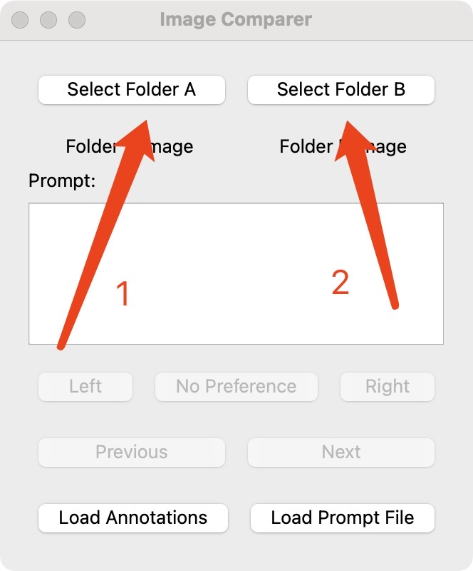
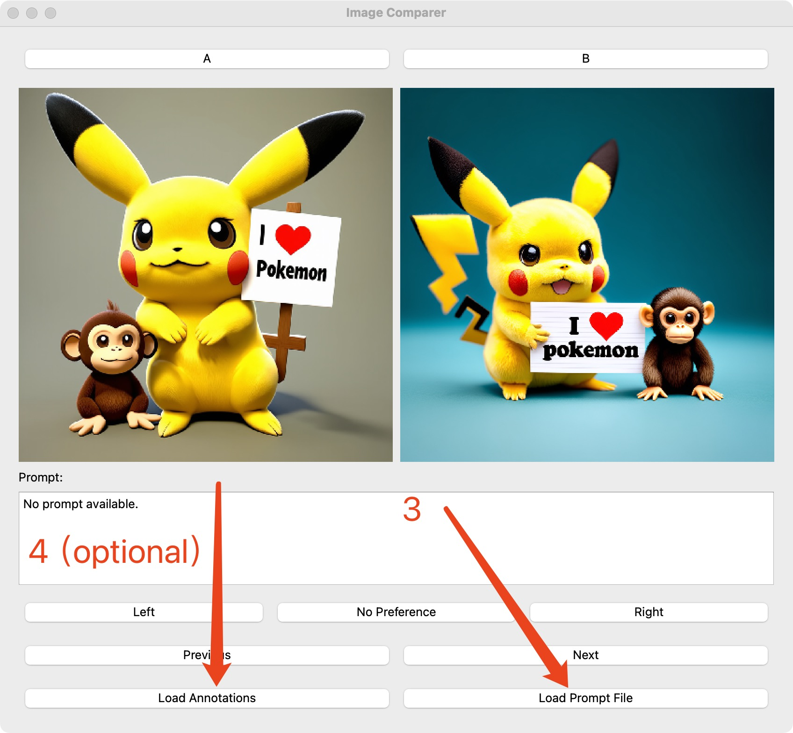

# preference annotator

Load two folders and manually annotate the preference for each image pair from the two image folders.


```pip install PyQt5 Pillow```

then run


```python image_preference.py```


## Steps

- load image folder A
- load image folder B
- load the prompt json file
- (optional) load the previsouly saved annotation json file 
- begin to anotate
- exit and save your annotations

 
 
