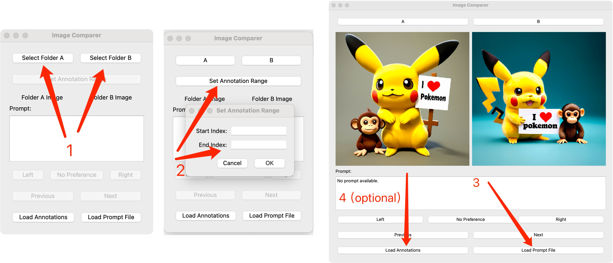

# preference annotator 

 

Load two folders and manually annotate the preference for each image pair from the two image folders.


```pip install PyQt5 Pillow```

then run


```python image_preference.py```


## Steps

- 1. Load image folder A and folder B ([Google drive](https://drive.google.com/drive/folders/10PwFh1z7TYansiyvGyP2ls73vkl1V1Z_?usp=drive_link))

  **Please select correct folder when loading image folder.**
  
- 2. Set up the range of images you need to annotate.**
- 3. Load the prompt json file (imgName2prompt.json)
- 4. Load the previsouly saved annotation json file (optional)
- 5. Begin to anotate. Select the image you prefere. (click the buttom ```left```, ```right```, or ```no preference```)
- 6. Exit and save your annotations
  
  **The system will automatically save your annotations as annotations.json. This file can also be used to resume your annotation**
